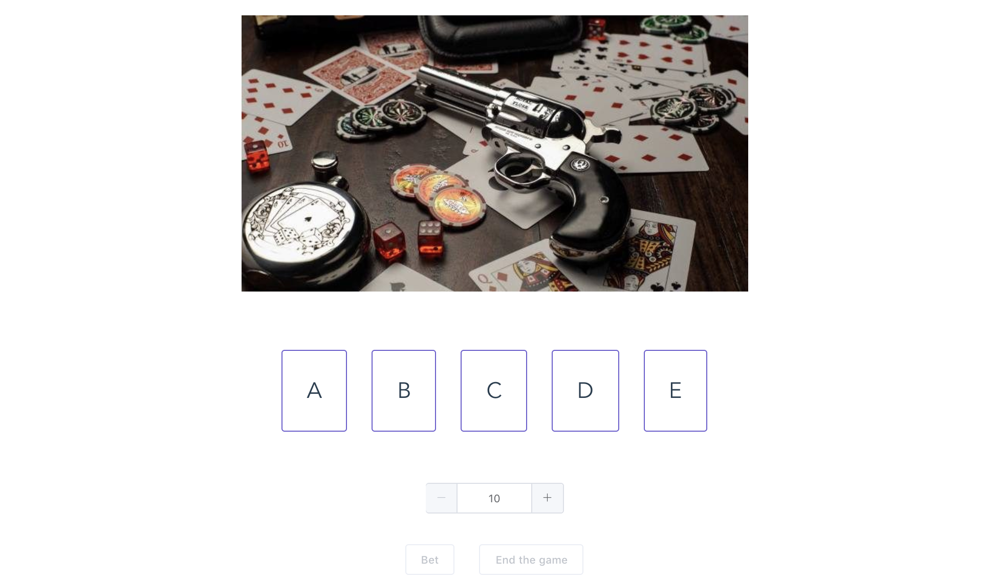
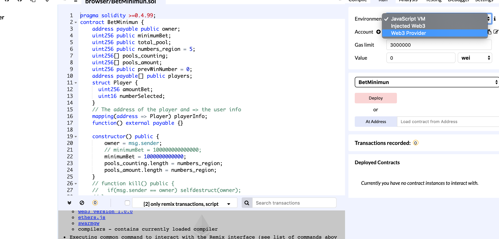

# BetMinimum - Blockchain Cloud Application

An interesting game application powered by `Blockchain` (`Ethereum`).




## Get Started

1. Start the ethereum

```bash
geth --networkid 10101 --rpc --rpcaddr "0.0.0.0" --rpcport "8545" --rpcapi "web3,eth,net,debug,personal" --rpccorsdomain "*" --testnet console
```

2. Create the main miner account

```bash
personal.newAccount("password")
```

3. Start the miner job

```bash
miner.start()
```

4. Deploy the contract

Please use the friendly Remix IDE :)



5. Start the server

```bash
cd app
npm start
```

6. Start the client

```bash
cd client
yarn serve # or `npm run serve`
```

7. Enjoy it 🤣
